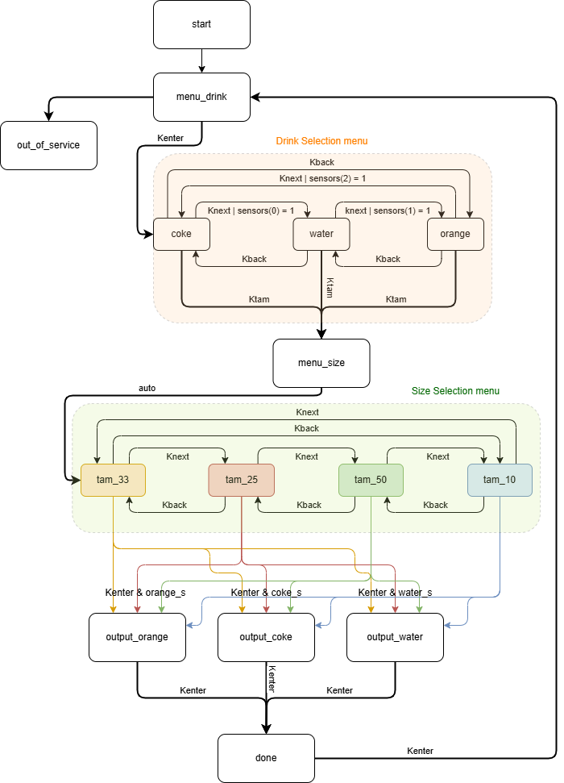

# Automatic Product Offering Machine 🥤🍹🍺 🤖

A digital systems project implemented on an FPGA board that simulates a beverage vending machine with multiple operation modes, product selections, and size options.

**Final Grade: 18/20**

## Project Overview

This project was developed as part of the Digital Systems Laboratory course in the Integrated Master's Degree in Electronics and Telecommunications Engineering at the University of Aveiro. It implements a fully functional beverage vending machine using VHDL and an FPGA board. The system includes multiple operation modes, product selection capabilities, size options, and simulated sensors for inventory management.

## Features

### Base Requirements
- **Welcome Sequence**: Displays "OLA" (Hello) flashing at 10Hz for 4 seconds during initialization
- **Product Selection Mode**: User can select between Coca-Cola, Water, or Orange Juice
- **Size Selection Mode**: Options for 25cl, 33cl, 50cl, or 10dl bottles (default: 33cl)
- **Dispensing Simulation**: LED indicators for dispensing process and product availability
- **Reset Function**: Returns the machine to initial state

### Additional Implementations ✨
- **Beverage Level Sensors**: Simulated sensors to detect when a beverage is out of stock
- **Dynamic Menu Adaptation**: Automatically removes beverages from the menu when their sensors indicate empty
- **Out of Service Mode**: Activates when all beverages are out of stock
- **Enhanced Navigation**: Implemented both forward and backward navigation through menu options
- **Product Pickup Simulation**: Simulated product pickup by requiring user confirmation when beverage is ready
- **Comprehensive State Machine**: Designed with 15 states to handle all functionalities and edge cases

## Hardware

- [Altera DE2-115 Development and Education Board](https://www.terasic.com.tw/cgi-bin/page/archive.pl?Language=English&No=502)

## System Architecture

The implementation consists of 5 main modules:

1. **MaqOferFSM**: Main state machine controlling all functionalities (15 states)
2. **TwoTimers**: Manages timing for initialization sequence (4s) and beverage dispensing (6s)
3. **Inputs**: Processes button inputs with debouncing for clean signal transition
4. **Display7seg**: Controls the 7-segment displays for user interface
5. **FreqDivider**: Divides the 50MHz clock to generate the 10Hz signal for the welcome sequence

## State Machine Diagram

The main state machine includes states for:
- Initialization
- Product selection menu (with 3 beverage options)
- Size selection menu (with 4 size options)
- Beverage dispensing
- Out of service
- Completion state

## User Manual

### Control Buttons
- **KEY0**: Enter/Select/Continue
- **KEY1**: Size selection menu
- **KEY2**: Next selection
- **KEY3**: Previous selection
- **SW0**: Reset/Program stop/Return to start
- **SW1**: Coca-Cola level sensor
- **SW2**: Water level sensor
- **SW3**: Orange Juice level sensor

### Output Indicators
- **LEDR0**: Ready state LED
- **LEDR1**: Beverage dispensing simulation LED
- **LEDG1**: Product ready LED
- **HEX0-HEX3**: Seven-segment displays

### Operation Modes

#### 1. Initialization
- On startup, the display shows "OLA" flashing at 10Hz for 4 seconds  
   
   

- During this time, no product selection is possible

#### 2. Product Selection
- After initialization, the display shows "EPro" (Choose a Product)  
   
 
- User can navigate through available beverages using Next/Previous buttons  [Sumo de laranja (Orange Juice), Coca-Cola, Agua (Water)]  
   
   
   
 
- Selection is confirmed with Enter button **[KEY0]**
- If a beverage sensor indicates empty, that option is removed from the menu

#### 3. Size Selection
- After selecting a product, press KEY1 to enter size selection mode  
- Default size is   
- Navigate through sizes using Next/Previous buttons  [25Cl,33Cl, 50Cl,10Dl]  
   
   
   
   

- Confirm size with Enter button **[KEY0]**

#### 4. Beverage Dispensing
- After confirming product and size, the red LED activates for 6 seconds
- Display shows the selected beverage
- When dispensing is complete, "done" appears on the display and the green LED activates  
    
 
- Press Enter to return to product selection mode **[KEY0]**

#### 5. Out of Service

- Activates when all beverage sensors indicate empty [sEbE - Sem Bebida]  
   
- Machine requires refilling and reset to resume operation

## Implementation Details

The project was implemented using VHDL with a structural approach for the top-level design. The main state machine controls the system's behavior while interacting with timers, input processing, and display modules.

The clock signal operates at 50MHz and is divided to create necessary timing signals, such as the 10Hz signal for the welcome sequence.

### Beyond the Requirements

The project exceeds the base requirements through several key enhancements:

1. **Smart Inventory Management**: Implementation of beverage level sensors (SW1-SW3) that actively monitor stock levels and affect machine behavior
2. **Bidirectional Navigation**: Added both forward (KEY2) and backward (KEY3) navigation, improving user experience
3. **Realistic Dispensing Simulation**: Implemented a complete dispensing cycle with visual feedback and user confirmation
4. **Fault Tolerance**: Out of service mode that gracefully handles the situation when all products are depleted
5. **Comprehensive State Machine**: Designed with 15 states instead of the minimum required, allowing for more refined control and better user experience

## Future Enhancements
- Interactive menu navigation using a rotary encoder
- Connection to physical motors for actual product dispensing
- Product inventory management mode for adding/removing beverage options

## Project Files

There's two versions of the project
- Quartus_Prime_Project_git_release 
  - A modified version optimized for GitHub, featuring improved code organization and clearer comments.
  - Note: Since I don't have access to the specific FPGA, this version has not been tested on the actual hardware.
- Quartus_Prime_Project_Original
  - The original files exactly as they were submitted for the assignment.

## Development Information
- Developed for Digital Systems Laboratory course
- Academic Year: 2020/2021
- Developer: João Fernandes

## License
This project is provided for educational purposes.